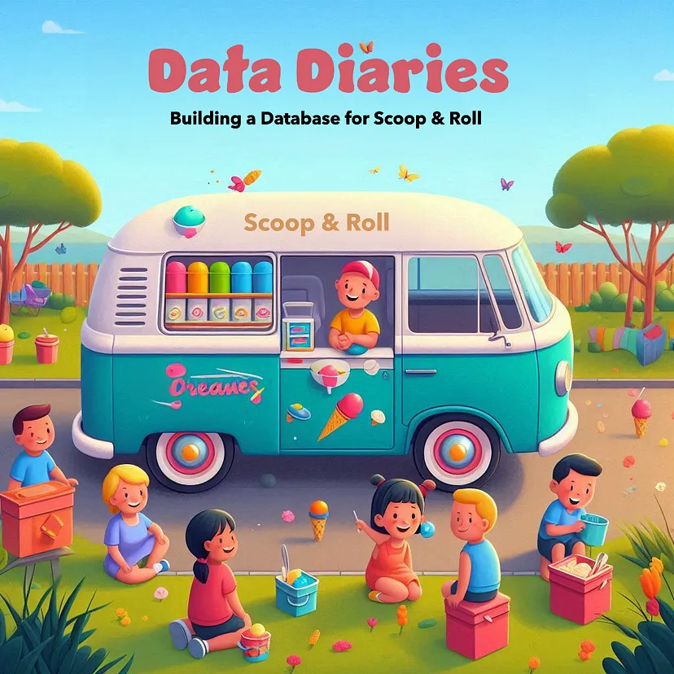

# Scoop-and-Roll

Scoop &amp; Roll: Database Design Journey - This repo accompanies the Scoop &amp; Roll blog series, showcasing real-world database design. Follow step-by-step as we build the database, covering key SQL concepts like stored procedures, transactions, and reporting functions.
